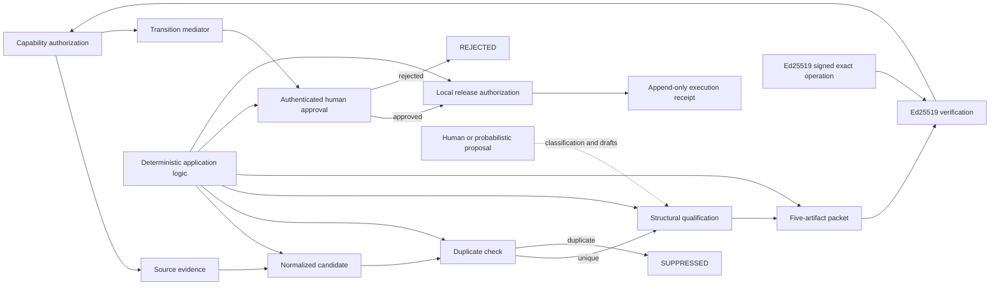

# Governed Signal-to-Content

[](https://doi.org/10.5281/zenodo.21762787)

> **This repository does not automate publication.**
>
> **It automates the governed preparation of evidence-backed publication candidates.**

**Status:** v0.1.0 released and archived by Zenodo. Verified version DOI: [10.5281/zenodo.21762787](https://doi.org/10.5281/zenodo.21762787).

Governed Signal-to-Content is a local-first Python reference implementation for turning an external technical signal into an inspectable content packet without giving probabilistic output authority over workflow state.

## Project thesis

**Probabilistic intelligence embedded inside deterministic systems.**

Human or model-assisted interpretation may propose classifications and drafts. Only deterministic application logic may change authoritative workflow state. Evidence identity, state, approvals, and execution receipts remain durable after the proposing context is gone.

## Exact system boundary

The project does:

- create a candidate from an external source URL;
- preserve supplied evidence bytes with SHA-256 identity, or record an honest URL-only reference;
- normalize candidates and suppress deterministic duplicates;
- validate a classification that separates facts, inferences, similarities, and trends;
- atomically generate a fixed five-artifact packet plus sources and a packet receipt;
- bind each new packet to one canonical `brand_id × channel_id × destination_id`
  scope at generation time;
- require an Ed25519-authenticated human principal for approval, rejection, and local
  release authorization;
- require an explicit active principal-by-capability-by-state-by-exact-scope grant for
  each packet authority operation, with signed and chained policy administration;
- persist workflow state and a locally tamper-evident transition-event chain in SQLite,
  then append exact chain-bearing receipts to JSONL.

The project does not:

- autonomously search the web;
- bundle or call a language model;
- decide that probabilistic output is authoritative;
- post to social media or another publication platform;
- archive remote content when only a URL is provided;
- create GitHub Releases, packages, DOIs, or Zenodo deposits.

`RELEASED` means **locally authorized for downstream publication**. It does not mean posted online.

## Architecture



Discovery and interpretation adapters are proposal-only interfaces. The state machine and SQLite persistence form the authority boundary. See [architecture](docs/architecture.md) and [governance model](docs/governance-model.md).

## State machine

The main path is:

```text
DISCOVERED
  -> EVIDENCE_PRESERVED
  -> NORMALIZED
  -> DUPLICATE_CHECKED
  -> QUALIFIED
  -> PACKET_GENERATED
  -> AWAITING_APPROVAL
  -> APPROVED
  -> RELEASED
```

`SUPPRESSED`, `REJECTED`, and `FAILED` are terminal outcomes in v0.1.0. Invalid jumps are rejected and receipted. In particular, `DISCOVERED -> APPROVED`, `QUALIFIED -> RELEASED`, and release without approval are not allowed. The complete map is documented in [state-machine.md](docs/state-machine.md) and implemented in [`state_machine.py`](src/governed_signal_to_content/state_machine.py).

## Quickstart

Python 3.11 or newer is required.

```powershell
git clone https://github.com/noblebrendon-cloud/governed-signal-to-content.git
Set-Location governed-signal-to-content
python -m venv .venv
.\.venv\Scripts\Activate.ps1
python -m pip install -e ".[dev]"
gs2c --help
```

Initialize runtime data outside the tracked repository:

```powershell
gs2c init --workspace E:\gs2c-workspace
```

Generate signing material outside both the repository and governed workspace, then
perform the one-time bootstrap of the empty principal registry. The private key remains
at the operator-selected path; only its public verifier is stored in SQLite.

```powershell
gs2c principal-keygen `
  --private-key E:\gs2c-credentials\reviewer-private.pem `
  --public-key E:\gs2c-credentials\reviewer-public.pem
gs2c principal-bootstrap --workspace E:\gs2c-workspace `
  --principal-id reviewer-1 `
  --public-key E:\gs2c-credentials\reviewer-public.pem
```

## CLI workflow

Before approve, reject, or release, use the signed capability-policy workflow to
bootstrap `policy.manage_capabilities` and explicitly grant the needed operational
capabilities. Migration grants nothing. For example, bootstrap policy administration:

```powershell
gs2c prepare-policy-operation --workspace E:\gs2c-workspace `
  --operation bootstrap-capability-policy --principal-id reviewer-1 `
  --reason "Initialize capability administration." `
  --output E:\gs2c-operations\policy-bootstrap.json
gs2c sign-operation --operation-file E:\gs2c-operations\policy-bootstrap.json `
  --private-key E:\gs2c-credentials\reviewer-private.pem `
  --output E:\gs2c-operations\policy-bootstrap-signed.json
gs2c bootstrap-policy-admin --workspace E:\gs2c-workspace --actor "Human Reviewer" `
  --authenticated-operation E:\gs2c-operations\policy-bootstrap-signed.json
```

Then use `prepare-policy-operation --operation grant-capability` followed by
`sign-operation` and `grant-capability` for each of `packet.approve`, `packet.reject`,
and `packet.release` that the principal should hold. Every operational grant must name
the exact canonical `--brand-id`, `--channel-id`, and `--destination-id`; these are
logical local identifiers, never credentials. See
[local-first operation](docs/local-first-operation.md) for the complete workflow.

```powershell
gs2c ingest --workspace E:\gs2c-workspace `
  --title "Standalone skill governance" `
  --source-url "https://docs.cloud.google.com/agent-registry/overview"

gs2c normalize --workspace E:\gs2c-workspace --candidate-id CANDIDATE_ID
gs2c deduplicate --workspace E:\gs2c-workspace --candidate-id CANDIDATE_ID
gs2c qualify --workspace E:\gs2c-workspace --candidate-id CANDIDATE_ID `
  --classification .\examples\classification.example.json
gs2c generate --workspace E:\gs2c-workspace --candidate-id CANDIDATE_ID `
  --content-inputs .\examples\content_inputs.example.json
gs2c packet-scope --workspace E:\gs2c-workspace --packet-id PACKET_ID

gs2c prepare-operation --workspace E:\gs2c-workspace --operation approve `
  --packet-id PACKET_ID --principal-id reviewer-1 `
  --output E:\gs2c-operations\approve-envelope.json
gs2c sign-operation --operation-file E:\gs2c-operations\approve-envelope.json `
  --private-key E:\gs2c-credentials\reviewer-private.pem `
  --output E:\gs2c-operations\approve-signed.json
gs2c approve --workspace E:\gs2c-workspace --packet-id PACKET_ID `
  --actor "Human Reviewer" `
  --authenticated-operation E:\gs2c-operations\approve-signed.json

gs2c prepare-operation --workspace E:\gs2c-workspace --operation release `
  --packet-id PACKET_ID --principal-id reviewer-1 `
  --output E:\gs2c-operations\release-envelope.json
gs2c sign-operation --operation-file E:\gs2c-operations\release-envelope.json `
  --private-key E:\gs2c-credentials\reviewer-private.pem `
  --output E:\gs2c-operations\release-signed.json
gs2c release --workspace E:\gs2c-workspace --packet-id PACKET_ID `
  --actor "Human Release Authorizer" `
  --authenticated-operation E:\gs2c-operations\release-signed.json
gs2c status --workspace E:\gs2c-workspace
gs2c receipt --workspace E:\gs2c-workspace --run-id RUN_ID
gs2c verify-integrity --workspace E:\gs2c-workspace
```

`verify-integrity` reports canonical-chain, canonical-policy, and JSONL projection
validity separately from projection completeness. The SHA-256 chain detects partial
local tampering; it is not a digital signature or an externally anchored history.

Use `--source-file PATH` with `ingest` to copy and verify local evidence bytes. Without it, the evidence record has `content_preserved: false`.

## Example packet

The [Google Cloud Agent Registry example](content/google_agent_registry_example/01_linkedin_analysis.md) is a conservative comparison based only on four Google Cloud primary sources. Its seven-file directory contains the five required artifacts, `sources.json`, and a packet receipt with actual file hashes. The analysis explicitly separates:

1. documented facts;
2. reasonable inference;
3. direct structural similarity;
4. broader industry trend.

It does not claim equivalence between Google Cloud Agent Registry and Clarity Systems Group.

## Operational validation

The first real governed run processed the Google Agent Registry standalone-skill governance signal that motivated this project. See the [sanitized operational case study](docs/case-studies/google-agent-registry-v0.1.0/README.md), including its generated packet, receipt index, publication-status boundary, and observed friction.

The bounded next milestone is [v0.2.0 — Operational Watch Loop](docs/roadmap/v0.2.0-operational-watch-loop.md).

**One operational case completed; three-case validation target pending.**

## Evidence and receipt model

Runtime data belongs in a user-selected workspace:

```text
workspace/
├── evidence/
├── candidates/
├── packets/
├── approvals/
├── receipts/
│   └── run_receipts.jsonl
└── state/
    └── watch_state.sqlite
```

Preserved files are written to a new path, their original filenames and byte sizes are
recorded, and their bytes are verified by SHA-256. Structured manifests use canonical
JSON before hashing. Every accepted or rejected transition attempt receives a UUID
event/run ID. SQLite is the canonical authority for new transition events; the
append-only JSONL record is an outward projection of the exact stored event payload.
Prior receipt lines are never rewritten. Interrupted projections can be recovered with
`gs2c reconcile-receipts`.

## Approval boundary

Packet generation stops at `AWAITING_APPROVAL`. `approve`, `reject`, and `release`
require a signed, short-lived, single-use exact-operation envelope from the bootstrapped
trusted principal and an active exact grant: `packet.approve`, `packet.reject`, or
`packet.release` for both the canonical transition pair and the packet's exact brand,
channel, and destination. The `--actor` value remains compatibility/display text only and is
recorded separately as `asserted_actor`; it is never identity proof. Approval and release
also recompute the governed artifact hashes required by Slice 1.

The CLI is an adapter into one `TransitionMediator`. Successful verification creates an
immutable `AuthenticatedTransitionRequest`; state, target, decision, reason, manifest,
and approval values used for adjudication then come from that request. A narrow
`CanonicalTransitionService` owns the supported accepted-write path. Lower-level public
state-machine/database helpers refuse authority-sensitive state pairs.

SQLite stores the public Ed25519 verifier and canonical proof-consumption ledger. The
private key is never stored in SQLite, packets, approvals, events, receipts, or this
repository. Accepted transition events identify the authenticated principal, verifier,
scheme, operation ID, envelope hash, and proof hash. Historical events retain nullable
authentication fields and are not retroactively authenticated.

Authentication proves who signed the exact local operation; canonical capability policy
independently determines whether that principal may perform the state transition.
Authorization decisions, grants, and revocations are committed into the locally
tamper-evident event/receipt chain. Packet generation commits canonical scope into
`sources.json`, the packet manifest, the packet receipt, and SQLite. Signed packet
operations derive that scope from SQLite; approval/release requires equality among the
request, packet, approval, and authorizing grant. There are no wildcard, null-means-any,
prefix, or inherited scopes.

Schema 6 adds a separate privileged external-effect boundary. A fresh
`effect.manage_bindings` grant is required to register an immutable logical destination
binding or an executor public identity; this capability is never granted by policy
bootstrap. A `RELEASED` packet can then produce one canonical effect request whose hash
binds its release event, approval, release grant, exact scope, destination binding,
artifact hashes, adapter, target reference, credential reference, and stable idempotency
key. The main process claims the request and later accepts only an Ed25519-signed result
from a registered executor.

The bundled executor supports only the offline `test.capture` adapter. Credential values
are resolved inside the executor from its environment and never enter command arguments,
SQLite, events, receipts, or capture files. This is provider-neutral test infrastructure,
not a live publisher; it claims neither remote exactly-once execution nor protection from
complete host compromise.

## Repository structure

```text
config/    example monitoring, qualification, packet, and source policies
content/   tracked seven-file example packet
docs/      architecture and operating documentation
examples/  validated candidate, classification, and draft inputs
schemas/   JSON Schema contracts
scripts/   Windows task-runner examples
src/       Python src-layout package and adapter contracts
tests/     state, identity, packet, approval, receipt, and schema tests
```

## Current limitations

- Discovery and interpretation are interfaces only; no provider is bundled.
- URL-only ingestion records a reference and does not download or archive content.
- Duplicate matching is intentionally narrow: SHA-256 source identity, normalized URL, and selected development identifiers.
- SQLite and JSONL are designed for a local operator, not concurrent distributed writers.
- The trusted-principal bootstrap is one-time for an empty registry; rotation, revocation,
  additional-principal administration, and protection after host/private-key compromise
  are not implemented.
- `RELEASED` is local authorization only. The Slice 7 capture executor exercises the
  effect boundary without network access or live publication.

## Roadmap

- optional signing or external anchoring for the local tamper-evident chain;
- additional local discovery adapters;
- richer development-identifier extraction;
- configurable qualification policies with the same deterministic authority boundary;
- optional downstream publisher adapters that still require explicit human authorization;
- future substantive releases after operational validation and metadata review.

## Citation

Use [CITATION.cff](CITATION.cff) or GitHub's **Cite this repository** interface. The archived `v0.1.0` software version has the verified DOI [10.5281/zenodo.21762787](https://doi.org/10.5281/zenodo.21762787).

That identifier is the **version DOI for v0.1.0**. This repository does not record or infer a Zenodo concept DOI; a concept DOI should be added only if it is separately verified.

## Zenodo release status

Zenodo archived GitHub Release `v0.1.0` and issued the verified version DOI [10.5281/zenodo.21762787](https://doi.org/10.5281/zenodo.21762787). Future releases receive their own version records; no concept DOI is recorded here. See [the Zenodo release process](docs/zenodo-release-process.md).

## License

MIT License. Copyright (c) 2026 Brendon R. Coleman.
