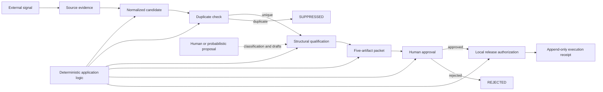

# Governed Signal-to-Content

> **This repository does not automate publication.**
>
> **It automates the governed preparation of evidence-backed publication candidates.**

**Status:** v0.1.0 implementation prepared; first archival release pending Zenodo repository activation.

Governed Signal-to-Content is a local-first Python reference implementation for turning an external technical signal into an inspectable content packet without giving probabilistic output authority over workflow state.

## Project thesis

**Probabilistic intelligence embedded inside deterministic systems.**

Human or model-assisted interpretation may propose classifications and drafts. Only deterministic application logic may change authoritative workflow state. Evidence identity, state, approvals, and execution receipts remain durable after the proposing context is gone.

## Exact system boundary

The project does:

- create a candidate from an external source URL;
- preserve supplied evidence bytes with SHA-256 identity, or record an honest URL-only reference;
- normalize candidates and suppress deterministic duplicates;
- validate a classification that separates facts, inferences, similarities, and trends;
- atomically generate a fixed five-artifact packet plus sources and a packet receipt;
- require a named human approval before local release authorization;
- persist workflow state in SQLite and append transition receipts to JSONL.

The project does not:

- autonomously search the web;
- bundle or call a language model;
- decide that probabilistic output is authoritative;
- post to social media or another publication platform;
- archive remote content when only a URL is provided;
- create GitHub Releases, packages, DOIs, or Zenodo deposits.

`RELEASED` means **locally authorized for downstream publication**. It does not mean posted online.

## Architecture



Discovery and interpretation adapters are proposal-only interfaces. The state machine and SQLite persistence form the authority boundary. See [architecture](docs/architecture.md) and [governance model](docs/governance-model.md).

## State machine

The main path is:

```text
DISCOVERED
  -> EVIDENCE_PRESERVED
  -> NORMALIZED
  -> DUPLICATE_CHECKED
  -> QUALIFIED
  -> PACKET_GENERATED
  -> AWAITING_APPROVAL
  -> APPROVED
  -> RELEASED
```

`SUPPRESSED`, `REJECTED`, and `FAILED` are terminal outcomes in v0.1.0. Invalid jumps are rejected and receipted. In particular, `DISCOVERED -> APPROVED`, `QUALIFIED -> RELEASED`, and release without approval are not allowed. The complete map is documented in [state-machine.md](docs/state-machine.md) and implemented in [`state_machine.py`](src/governed_signal_to_content/state_machine.py).

## Quickstart

Python 3.11 or newer is required.

```powershell
git clone https://github.com/noblebrendon-cloud/governed-signal-to-content.git
Set-Location governed-signal-to-content
python -m venv .venv
.\.venv\Scripts\Activate.ps1
python -m pip install -e ".[dev]"
gs2c --help
```

Initialize runtime data outside the tracked repository:

```powershell
gs2c init --workspace E:\gs2c-workspace
```

## CLI workflow

```powershell
gs2c ingest --workspace E:\gs2c-workspace `
  --title "Standalone skill governance" `
  --source-url "https://docs.cloud.google.com/agent-registry/overview"

gs2c normalize --workspace E:\gs2c-workspace --candidate-id CANDIDATE_ID
gs2c deduplicate --workspace E:\gs2c-workspace --candidate-id CANDIDATE_ID
gs2c qualify --workspace E:\gs2c-workspace --candidate-id CANDIDATE_ID `
  --classification .\examples\classification.example.json
gs2c generate --workspace E:\gs2c-workspace --candidate-id CANDIDATE_ID `
  --content-inputs .\examples\content_inputs.example.json
gs2c approve --workspace E:\gs2c-workspace --packet-id PACKET_ID `
  --actor "Human Reviewer"
gs2c release --workspace E:\gs2c-workspace --packet-id PACKET_ID `
  --actor "Human Release Authorizer"
gs2c status --workspace E:\gs2c-workspace
gs2c receipt --workspace E:\gs2c-workspace --run-id RUN_ID
```

Use `--source-file PATH` with `ingest` to copy and verify local evidence bytes. Without it, the evidence record has `content_preserved: false`.

## Example packet

The [Google Cloud Agent Registry example](content/google_agent_registry_example/01_linkedin_analysis.md) is a conservative comparison based only on four Google Cloud primary sources. Its seven-file directory contains the five required artifacts, `sources.json`, and a packet receipt with actual file hashes. The analysis explicitly separates:

1. documented facts;
2. reasonable inference;
3. direct structural similarity;
4. broader industry trend.

It does not claim equivalence between Google Cloud Agent Registry and Clarity Systems Group.

## Evidence and receipt model

Runtime data belongs in a user-selected workspace:

```text
workspace/
├── evidence/
├── candidates/
├── packets/
├── approvals/
├── receipts/
│   └── run_receipts.jsonl
└── state/
    └── watch_state.sqlite
```

Preserved files are written to a new path, their original filenames and byte sizes are recorded, and their bytes are verified by SHA-256. Structured manifests use canonical JSON before hashing. Every accepted or rejected transition attempt receives a UUID run ID and an append-only JSONL record. Prior receipt lines are never rewritten.

## Approval boundary

Packet generation stops at `AWAITING_APPROVAL`. `approve` binds an actor, time, prior state, and exact packet manifest hash to an approval record. `release` accepts only an `APPROVED` packet and creates local release authorization. It performs no external publication.

## Repository structure

```text
config/    example monitoring, qualification, packet, and source policies
content/   tracked seven-file example packet
docs/      architecture and operating documentation
examples/  validated candidate, classification, and draft inputs
schemas/   JSON Schema contracts
scripts/   Windows task-runner examples
src/       Python src-layout package and adapter contracts
tests/     state, identity, packet, approval, receipt, and schema tests
```

## Current limitations

- Discovery and interpretation are interfaces only; no provider is bundled.
- URL-only ingestion records a reference and does not download or archive content.
- Duplicate matching is intentionally narrow: SHA-256 source identity, normalized URL, and selected development identifiers.
- SQLite and JSONL are designed for a local operator, not concurrent distributed writers.
- `RELEASED` is local authorization only; downstream publication is outside the implementation.

## Roadmap

- signed or stronger tamper-evident receipt chains;
- additional local discovery adapters;
- richer development-identifier extraction;
- configurable qualification policies with the same deterministic authority boundary;
- optional downstream publisher adapters that still require explicit human authorization;
- first archival GitHub Release after Zenodo repository activation.

## Citation

Use [CITATION.cff](CITATION.cff) or GitHub's **Cite this repository** interface after the repository is published. Metadata is also prepared in [.zenodo.json](.zenodo.json). No DOI is claimed in this version.

## Zenodo release status

The repository metadata is ready, but the repository must first be enabled manually in the Zenodo GitHub integration. No tag or GitHub Release is part of the initial repository publication. Follow [the Zenodo release process](docs/zenodo-release-process.md) before creating `v0.1.0`.

## License

MIT License. Copyright (c) 2026 Brendon R. Coleman.
