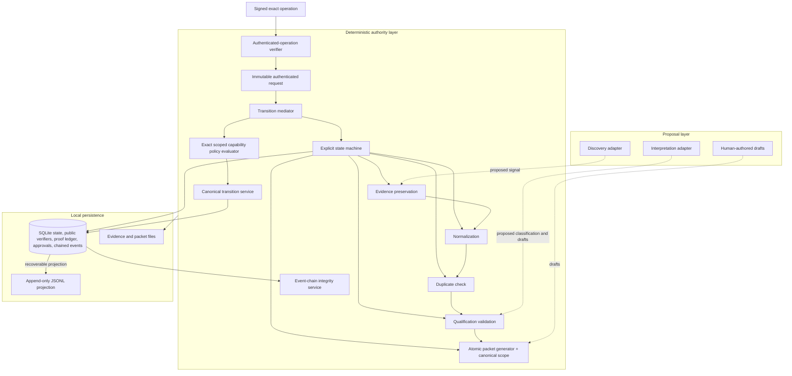

# Architecture

Governed Signal-to-Content is a narrow local reference implementation. It separates proposal-producing components from components that own durable state.

## Components

- `evidence.py` creates stable IDs, copies supplied source files to new paths, and verifies SHA-256 identity.
- `deduplication.py` performs deterministic URL normalization and duplicate comparison.
- `qualification.py` validates a proposed classification and decides whether its positive decision can be applied from the current state.
- `packets.py` validates draft inputs and exact logical brand/channel/destination scope,
  binds that scope into `sources.json`, the packet manifest and receipt, writes through a
  temporary directory, and atomically exposes a fixed packet.
- `authentication.py` manages Ed25519 public-verifier bootstrap, canonical signed
  operation creation and verification, proof freshness, replay evidence, and construction
  of an immutable authenticated transition request.
- `transition_mediator.py` is the one supported authority-sensitive application boundary.
  It derives execution semantics from that request, verifies current state, artifacts,
  approval evidence, and the transaction-time authorization result, then routes an
  admissible request to the narrow canonical transition service.
- `authorization.py` defines the fixed capability vocabulary, derives packet capability
  requirements, and evaluates exact active principal/state/brand/channel/destination
  grants inside SQLite writer transactions.
- `approvals.py` is a compatibility facade into the mediator; it contains no independent
  approval or release authority logic.
- `state_machine.py` validates the deterministic transition map and owns ordinary
  internal workflow progression. Its public packet path rejects authority-sensitive
  pairs, which only the mediated canonical service may commit.
- `database.py` persists candidate, packet, evidence, public trusted-principal verifier,
  consumed authenticated operation, scoped capability grants/revocations, scoped packet
  and approval identity, canonical transition-event data, and the serialized chain head
  in SQLite. Authorization,
  event sequence/hash creation, and associated state/evidence writes share one immediate
  transaction.
- `integrity.py` defines the versioned SHA-256 event hash, legacy activation checkpoint,
  tail validation, and read-only full-chain/policy/scope/projection verification. It
  never stores a private signing key or treats the local hash chain as a signature.
- `receipts.py` projects the exact canonical event payload to an immutable-by-contract
  JSONL log, including its committed chain identity, and reconciles interrupted
  projections without recomputing that identity.

Runtime files are never required inside the source tree. A user selects the workspace for every command.

The actor field remains an asserted display value distinct from the authenticated
principal recorded for authority-sensitive operations. Ed25519 authentication binds
identity to an exact, short-lived, single-use operation. Independent default-deny
capability policy binds that principal to one fixed action and state pair. Native
packet capabilities additionally require exact equality among signed request scope,
canonical packet scope, approval scope where applicable, and grant scope. Canonical
scope is a versioned triple of normalized lowercase logical identifiers; no component
is a credential and no wildcard or inheritance rule exists. Native canonical events form
one locally tamper-evident SHA-256 chain;
JSONL faithfully projects that chain rather than creating a second authority source.
A privileged external-effect executor, destination-to-credential mapping, live account
validation, host-compromise protection, independently signed or anchored history, and
external publication credentials remain outside this slice.

The mediation boundary structures supported GS2C flows; it is not an in-process security
sandbox. Arbitrary hostile Python already running inside the trusted process could still
import internal modules or write the database. Filesystem artifact observation also
cannot be jointly ACID with SQLite. `RELEASED` remains local authorization only.
