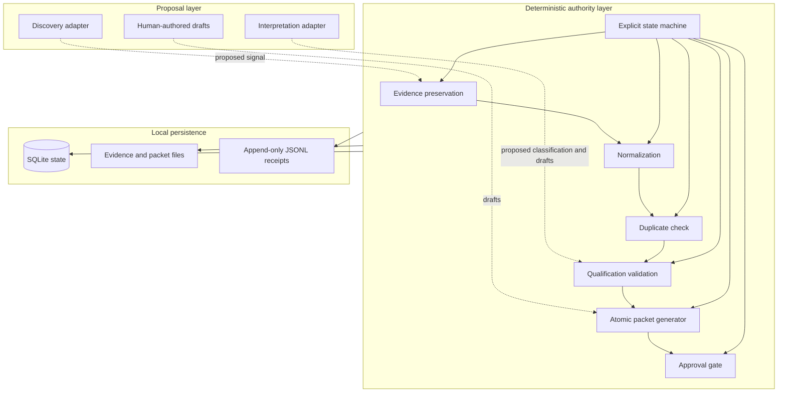

# Architecture

Governed Signal-to-Content is a narrow local reference implementation. It separates proposal-producing components from components that own durable state.

## Components

- `evidence.py` creates stable IDs, copies supplied source files to new paths, and verifies SHA-256 identity.
- `deduplication.py` performs deterministic URL normalization and duplicate comparison.
- `qualification.py` validates a proposed classification and decides whether its positive decision can be applied from the current state.
- `packets.py` validates draft inputs, writes through a temporary directory, records warnings, and atomically exposes a fixed packet.
- `approvals.py` records a named human decision and gates local release authorization.
- `state_machine.py` is the transition authority. It records both accepted and rejected attempts.
- `database.py` persists candidate, packet, evidence, and approval metadata in SQLite.
- `receipts.py` appends canonical JSON to an immutable-by-contract JSONL log.

Runtime files are never required inside the source tree. A user selects the workspace for every command.
