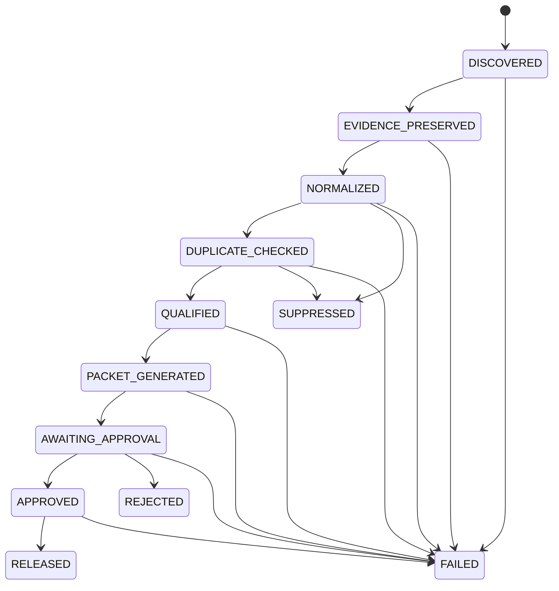

# State machine

The application recognizes these authoritative states:

`DISCOVERED`, `EVIDENCE_PRESERVED`, `NORMALIZED`, `DUPLICATE_CHECKED`, `QUALIFIED`, `PACKET_GENERATED`, `AWAITING_APPROVAL`, `APPROVED`, `RELEASED`, `SUPPRESSED`, `REJECTED`, and `FAILED`.

`RELEASED`, `SUPPRESSED`, `REJECTED`, and `FAILED` are terminal in version 0.1.0.

An attempted transition is checked against the map before an update. Rejected attempts
leave state unchanged, commit a canonical SQLite transition event with
`outcome: rejected`, and project that event to JSONL. A classification with
`qualification_decision: false` is also recorded as a rejected request to reach
`QUALIFIED`; the proposal cannot assign a state.

Accepted transitions commit the authoritative state mutation and canonical transition
event in one SQLite transaction. The transaction also assigns the event's unique
sequence, predecessor hash, event hash, and chain-head update. Packets mirror their
candidate's state from `PACKET_GENERATED` forward. Approval, rejection, and release
update the packet and linked candidate together; the approval decision row also
participates in that transaction.

`AWAITING_APPROVAL → APPROVED`, `AWAITING_APPROVAL → REJECTED`, and
`APPROVED → RELEASED` are authority-sensitive. Each requires deterministic verification
of a trusted principal's Ed25519 signature over the exact operation. A plain
`asserted_actor` value cannot satisfy this requirement. They also require, respectively,
an active `packet.approve`, `packet.reject`, or `packet.release` grant scoped to the
exact state pair and the packet's exact canonical brand, channel, and destination.
Earlier deterministic workflow transitions do not require a human authentication or
capability proof.

Scope becomes canonical when a qualified candidate becomes `PACKET_GENERATED`. The
generator binds the validated `scope_version = 1.0` and full
`brand_id × channel_id × destination_id` triple into the packet manifest and receipt.
There is no supported in-place scope transition: a changed intended target requires a
new packet identity. Legacy packets with no scope cannot cross an authority-sensitive
edge and receive a consumed `SCOPE_REQUIRED` denial when the proof is identifiable.

The public `transition_packet` path and public database packet-transition helper reject
these three authority-sensitive pairs even when a caller supplies fabricated evidence.
Supported approval, rejection, and release paths instead pass an immutable authenticated
request through `TransitionMediator`; only `CanonicalTransitionService` invokes the
internal atomic authority persistence primitive. The state map remains the deterministic
admissibility rule used by the mediator.

For an accepted authority-sensitive transition, authenticated-operation consumption,
the canonical event, both packet and candidate mutations, and any approval decision
commit atomically with transaction-time authorization evidence and the exact grant ID.
That transaction rereads canonical packet scope and requires equality with both the
signed request and selected grant. Approval/rejection evidence records the same scope;
release also requires equality with the canonical approval scope.
The writer lock ensures that a revocation which commits first is observed before state
can change. A cryptographically verified request that lacks capability or fails state, object,
decision, approval, or artifact binding is consumed atomically with a rejected event so
it cannot become valid later. Invalid or unknown authentication material never mutates
state or creates approval authority. Exact replays are rejected against the canonical
consumption ledger rather than relying on incidental current state.

JSONL projection happens after the SQLite commit. An interrupted projection leaves the
event pending for deterministic reconciliation and cannot erase the accepted event,
state, or chain identity. Accepted, state-invalid, artifact-invalid, replay-rejected,
and identifiable authentication-failure events all use the same causal chain; a failure
without an identifiable canonical target still creates no event. See
[transition authority hardening](architecture/transition-authority-hardening.md).
