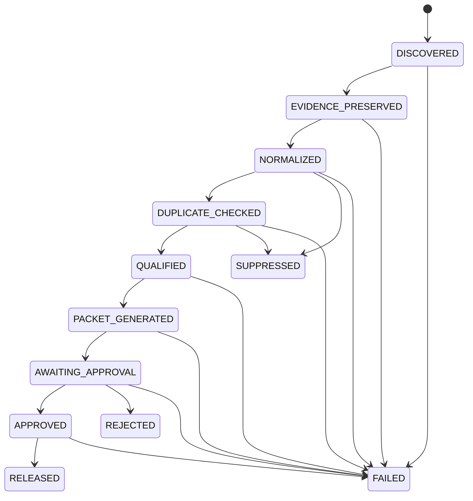

# State machine

The application recognizes these authoritative states:

`DISCOVERED`, `EVIDENCE_PRESERVED`, `NORMALIZED`, `DUPLICATE_CHECKED`, `QUALIFIED`, `PACKET_GENERATED`, `AWAITING_APPROVAL`, `APPROVED`, `RELEASED`, `SUPPRESSED`, `REJECTED`, and `FAILED`.

`RELEASED`, `SUPPRESSED`, `REJECTED`, and `FAILED` are terminal in version 0.1.0.

An attempted transition is checked against the map before an update. Rejected attempts leave state unchanged and append a receipt with `outcome: rejected`. A classification with `qualification_decision: false` is also recorded as a rejected request to reach `QUALIFIED`; the proposal cannot assign a state.

Packets mirror their candidate's state from `PACKET_GENERATED` forward. Approval, rejection, and release update the packet and linked candidate in one SQLite transaction.
